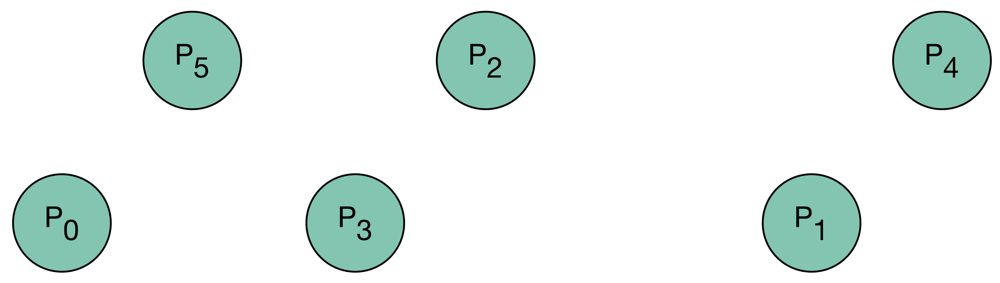

.. role:: cpp(code)

    :language: cpp

Cluster
=======

Overview
--------

Many H-Matrices are built from geometrical considerations. Usually, we have a
set of :math:`n` points in the plane or in the space, and the matrix :math:`A`
we want to approximate by an H-Matrix has a coefficient :math:`A_{i_0, i_1}`
that represents the interaction in between the points :math:`P_{i_0}` and
:math:`P_{i_1}`. For the approximation to be accuracte, one needs to reorder
the points so that :math:`P_{i_0}` and :math:`P_{i_1}` are closeby only when
the difference :math:`|i_0 - i_1|` is small. We'll make a hierarchy of clusters
for that purpose.

Let's take the following examples, with 6 points in the plane that we want to
recursively subdivide until we get leaves made of at most 2 points.

We need to change the ordering and build the following hierarchy of clusters

which will be represented by the following tree structure

where :math:`[i_{\text{begin}}, i_{\text{end}})` represents the set of indices
that belong to the cluster. As usual in :cpp:`C++`, the first index is included
but the last index is excluded.

Moreover, we need to known how the points have been reordered. The following
table shows how the have been reordered in our case:

========= = = = = = =
Old index 0 1 2 3 4 5
--------- - - - - - -
New index 0 4 3 2 5 1
========= = = = = = =

This reordering will be represented by the array :cpp:`{0, 4, 3, 2, 5, 1}`.

In order to do this job, we have a function :cpp:`cluster` that takes the
maximum number of points that we accept in our cluster leaves, and takes our
family of points :cpp:`point` as a :cpp:`il::Array2D<double>`. In dimension 2, if
out set is made of n points, the structure :cpp:`point` will have a size of
:cpp:`{n, 2}` and the point :math:`P_i` will have
:cpp:`{point(i, 0), point(i, 1)}` as coordinates. The function
:cpp:`il::cluster` will reorder the points inplace and return a :cpp:`struct`
of type :cpp:`Cluster` that aggregates a binary tree with the different clusters
named :cpp:`partition`, and the array that describes the permutation and named
:cpp:`permutation`.

For instance, here is a program that puts :cpp:`n` points on a circle in a
deterministic fashion that looks random, and subdivides the resulting point
into a cluster.

.. code-block:: cpp

    #include <cmath>
    #include <cluster/cluster.h>

    il::int_t n = 67;
    il::int_t k = 39;
    il::Array<double> point{n, 2};
    for (il::int_t i = 0; i < n; ++i) {
      point(i, 0) = std::cos((2 * il::pi * k * i) / n);
      point(i, 1) = std::sin((2 * il::pi * k * i) / n);
    }

    il::int_t leaf_size = 5;
    il::Cluster cluster = il::cluster(leaf_size, il::io, point);

