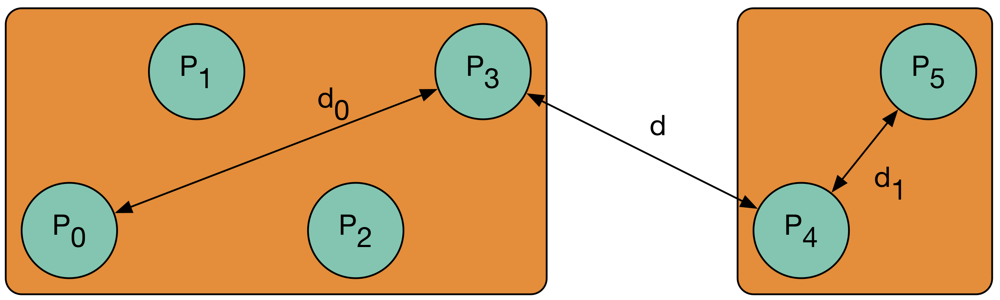

.. role:: cpp(code)

    :language: cpp

HMatrixTree
===========

Overview
--------

Once we are given a family of points as a :cpp:`il::Array2D<double>`, and a
hierarchy of clusters :cpp:`il::Tree<il::Range, 2>`, one can construct a
hierarchy of submatrices for the matrix of the interactions in between the
points :math:`P_{i_0}` and :math:`P_{i_1}`.

For that, we'll consider all the cluster leaves :math:`C_{\alpha_0}` and
:math:`C_{\alpha_1}` and compute both their diameter and the distance in
between them.

- **Diameter**: The diameter of a cluster is the maximal distance in between
  two points that belong to a cluster. Because this quantity is quite
  expensive to compute with a naive algorithm (the cost is :math:`n^2`), we
  currently use the following proxy: we compute the smallest bounding box that
  contains those points, and we compute the diameter of this box.

- **Distance**: The distance in between two clusters is the minimal distance
  in between a point of the first cluster, and a point of the second cluster.

Two clusters are said to be admissible when both :math:`d_0 \leq \eta d` and
:math:`d_1 \leq \eta d`. When two clusters are admissible, their associated
submatrix will be approximated by a low rank submatrix is the hierarchical
approximation.

Given a family of points, a clustering of those points and the parameter
:math:`eta`, the function :cpp:`hmatrixTree` computes the tree structure of
the associated H-Matrix. This is done with the following code:

.. code-block:: cpp

    #include <cmath>
    #include <cluster/cluster.h>

    il::Array2D<double> point = ...;
    il::Tree<il::Range, 2> tree = ...;
    double eta = 0.2;

    il::Tree<il::SubHMatrix, 4> hmatrix_tree = il::hmatrixTree(point, tree, eta);

For those who would like to use our clustering function to build the tree of
clusters, one would need to write the following code:

.. code-block:: cpp

    #include <cmath>
    #include <cluster/cluster.h>

    il::int_t n = 67;
    il::int_t k = 39;
    il::Array2D<double> point{n, 2};
    for (il::int_t i = 0; i < n; ++i) {
      point(i, 0) = std::cos((2 * il::pi * k * i) / n);
      point(i, 1) = std::sin((2 * il::pi * k * i) / n);
    }

    il::int_t leaf_size = 5;
    il::Cluster cluster = il::cluster(leaf_size, il::io, point);

    double eta = 0.2;
    il::Tree<il::SubHMatrix, 4> hmatrix_tree = il::hmatrixTree(point, cluster.partition, eta);

