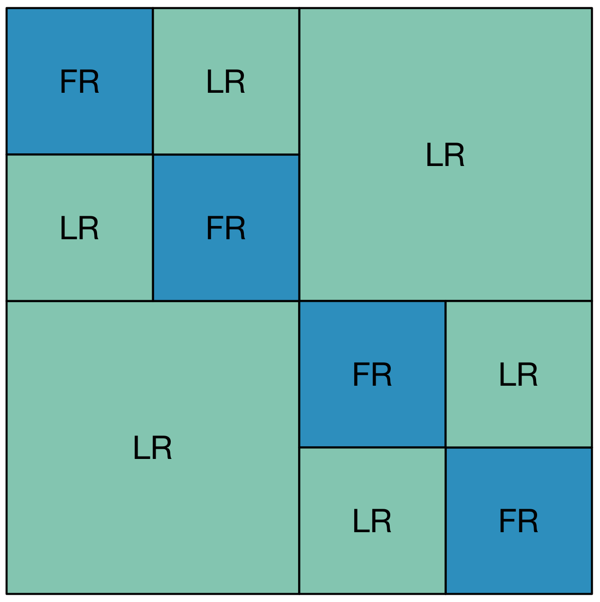
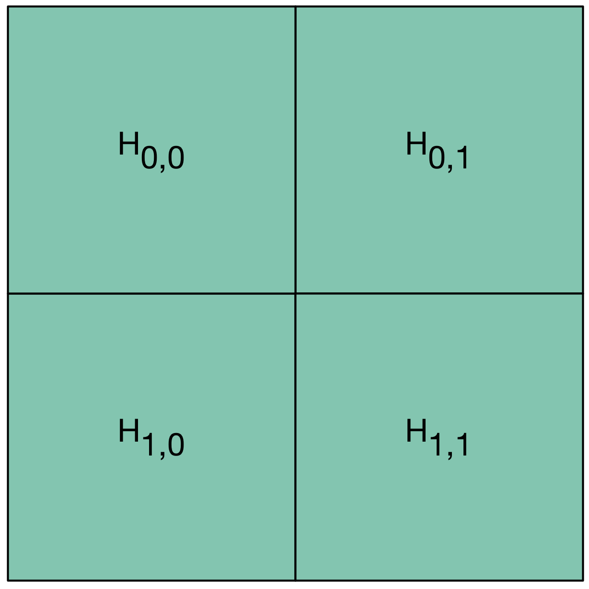
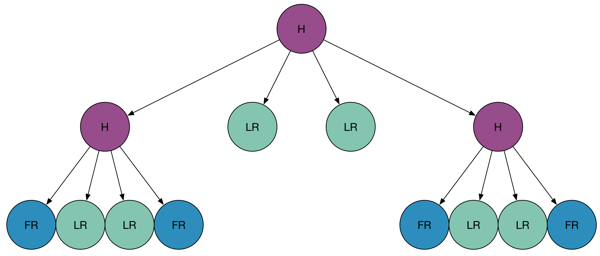

.. role:: cpp(code)

    :language: cpp

HMatrix
=======

Overview
--------

The :cpp:`il::HMatrix<T>` object is a data structure used to store a
Hierarchical matrix. Those matrices are compressed in the sense that some of
the submatrices they hold are low rank matrices and are stored as a product
of two matrices. To Keep things concrete, here is an example of a hierarchical
matrix:

Both the bottom left and the top right submatrices are tagged low rank. A
:math:`n_0` by :math:`n_1` matrix of rank below :math:`r` can
be factorized as :math:`A \cdot B^{T}` where :math:`A` is a matrix of :math:`n_0`
rows and :math:`r` columns and :math:`B` is a matrix of :math:`n_1` rows and :math:`r` columns.
It allows to store the submatrix with :math:`(n_0 + n_1)r` elements instead
of :math:`n_0 n_1` elements. If :math:`r` is small compared to both
:math:`n_0` and :math:`n_1`, this representation of the low rank matrix as a
product allows us to save both memory and floating point operations when
dealing with such matrices.

Hierarchical matrices are represented internally by quad trees. Contrary
to the mathematical convention where rows and columns are numbered from 1 to
n, we'll number all the rows and columns of our matrices starting from 0 as
with the C convention. A matrix :math:`H` with :math:`n_0` and :math:`n_1`
columns will be divided recursively into 4 submatrices:

- :math:`H_{0,0}` that is made from the rows from 0 (included) to
  :math:`n_0 / 2` (excluded) and the columns from 0 (included) to
  :math:`n_1 / 2` (excluded). If :math:`n_0` is even, :math:`n_0 / 2`
  should be treated as the euclidean quotient of :math:`n_0` by 2 (for instance,
  if :math:`n_0 = 7`, :math:`n_0 / 2 = 3`).
- :math:`H_{1,0}` that is made from the rows from :math:`n_0 / 2` to :math:`n_0`
  and the columns from 0 to :math:`n_1 / 2`.
- :math:`H_{0,1}` that is made from the rows from 0 to :math:`n_0 / 2` and the
  columns from :math:`n_1 / 2` to :math:`n_1`
- :math:`H_{1,1}` that is made from the rows from :math:`n_0 / 2` to :math:`n_0`
  and the columns from :math:`n_1 / 2` to :math:`n_1`.

The structure of the H-Matrix will be represented as a tree and each
hierarchical matrix will have 4 sons, written from left to right:
:math:`H_{0, 0}`, :math:`H_{1, 0}`, :math:`H_{0, 1}`, :math:`H_{1, 1}`. They
are stored in block column-major order.

Each submatrix can be of the following type:

- **A Full matrix**: In that case, all its coefficients are stored in a
  column-major order two dimensional array :cpp:`il::Array2D<T>`.
- **A Low-Rank matrix**: In that case, the matrix is stored as a the product
  :math:`A \cdot B^{T}` where :math:`A` and :math:`B` are both stored as
  column-major ordered matrices in an :cpp:`il::Array2D<T>` object.
- **A Hierarchical matrix**: In that case, the matrix will have 4 sons as
  submatrices.

This allows us to stores H-Matrix as trees. For instance, our first H-matrix
example

will be stored internally as the following quad tree.

To get read access the second full rank submatrix on the diagonal, one would
need to write the following code.

.. code-block:: cpp

    #include <hmat/HMatrix.h>

    void foo(const il::HMatrix<double>& H) {
      const il::spot_t s = H.root();
      const il::spot_t s00 = H.child(s, 0, 0);
      const il::spot_t s0011 = H.child(s, 1, 1);
      il::Array2DView<double> M = H.asFullRank(s0011);

      ...
    }

You also might want to write a program that output to the screen the structure
of your Hierarchical Matrix. This can be done that way:

.. code-block:: cpp

    #include <iostream>
    #include <hmat/HMatrix.h>

    void writeStructureRec(const il::String& position,
                           const il::HMatrix<double>& H, il::spot_t s);

    void writeStructure(const il::HMatrix<double>& H) {
      writeStructireRec("", H, H.root());
    }

    void writeStructureRec(const il::String& position,
                           const il::HMatrix<double>& H, il::spot_t s) {
      switch(H.type(s)) {
        case il::HMatrixType::Hierarchical: {
          il::String position00 = il::join(position.view(), "(0,0) -> ");
          writeStructureRec(position00, H, child(H, 0, 0);
          il::String position10 = il::join(position.view(), "(1,0) -> ");
          writeStructureRec(position10, H, child(H, 1, 0);
          il::String position01 = il::join(position.view(), "(0,1) -> ");
          writeStructureRec(position01, H, child(H, 0, 1);
          il::String position11 = il::join(position.view(), "(1,1) -> ");
          writeStructureRec(position11, H, child(H, 1, 1);
        } break;
        case il::HMatrixType::FullRank: {
          il::Array2DView<double> F = H.asFullRank(s);
          std::cout << position.asCString() << "Full rank of " << F.size(0) <<
                       " rows and " << F.size(1) << " columns." << std::endl;
        } break;
        case il::HMatrixType::LowRank: {
          il::Array2DView<double> A = H.asLowRankA(s);
          il::Array2DView<double> B = H.asLowRankA(s);
          std::cout << position.asCString() << "Low rank of " << A.size(0) <<
                       " rows and " << B.size(0) <<
                       " columns with a rank less or equal to " << A.size(1) <<
                       std::endl;
        } break;
        default:
          IL_UNREACHABLE;
      }
    }

No that we know how to read a H-Matrix, here is how we create them. At
construction, a H-Matrix as just a root node that is empty.

.. code-block:: cpp

    #include <hmat/HMatrix.h>

    il::HMatrix<double> H{};

To make things concrete, we'll construct a 2n by 2n hierarchical whith just
one level of hierarchy. As a consequence, it will be made of four blocks. The
first thing to do is to indicate that on the level 0, our matrix is
hierarchical. This is done with the :cpp:`SetHierarchical` method. Once this
is done, we can set its sons to the corresponding matrices that way:

.. code-block:: cpp

    #include <hmat/HMatrix.h>

    il::int_t n = 500;
    il::int_t r = 2;

    il::HMatrix<double> H{};
    const il::spot_s s = H.root();

    H.SetHierarchical(s);

    H.SetFullRank(H.child(s, 0, 0), n, n);
    H.SetLowRank(H.child(s, 1, 0), n, n, r);
    H.SetLowRank(H.child(s, 0, 1), n, n, r);
    H.SetFullRank(H.child(s, 1, 1), n, n);

At this stage, the matrix is Fully constructed and coherent. Even though
you are allowed to construct "uncoherent matrices" where for instance the
top left block does not have the same number of rows as the top right block,
many operations on H-Matrices suppose that they are coherent. Once matrices
are in a coherent state, we cal call the methods :cpp:`size(0)` and
:cpp:`size(1)` to get respectively the number of rows and the number of columns
of our matrix.

.. code-block:: cpp

    #include <iostream>
    #include <hmat/HMatrix.h>

    std::cout << "Our H-Matrix has " << H.size(0) << " rows and " << H.size(1)
              << " columns." << std::endl;

Before using our H-Matrix, it is important to fill the coefficients with
:cpp:`il::Array2DEdit<T>` objects.

.. code-block:: cpp

    #include <hmat/HMatrix.h>

    ...
    il::Array2DEdit<double> F = H.AsFullRank(H.child(s, 0, 0));
    for (il::int_t i1 = 0; i1 < F.size(1); ++i1) {
      for (il::int_t i0 = 0; i0 < F.size(0); ++i0) {
        F(i0, i1) = 1.0 / (2 + i0 + i1);
      }
    }

Linear Algebra
--------------

Once our matrix is fully constructed (coherent matrix with all the coefficients
filled), one can work on linear algebra with the same interface as with the
dense matrices.

.. code-block:: cpp

    #include <hmat/HMatrix.h>

    il::HMatrix<double> H = ...;
    il::Array<double> x{H.size(1), 0.0};
    il::Array<double> y = il::dot(H, x);

We also provide a way to solve linear system with a H-Matrix using the Gmres
algorithm. This algorithm needs a relative precision and a maximum number
of iterations for the stopping criteria. As this algorithm needs to store all
the previous vector of the iterations, it is quite memory intensive. As a
consequence, it is often used with a restart parameter. Here is an example
of its usage.

.. code-block:: cpp

  il::HMatrix<double> h = ...;
  il::HMatrixGenerator<double> matrix_free_h{h};

  const double relative_precision = 1.0e-3;
  const il::int_t max_nb_iterations = 100;
  const il::int_t restart_iteration = 20;
  il::MatrixFreeGmres<il::HMatrixGenerator<double>> gmres{
      relative_precision, max_nb_iterations, restart_iteration};

  il::Array<double> y{n, 1.0};
  il::Array<double> sol = gmres.Solve(matrix_free_h, y);
  const il::int_t nb_iterations = gmres.nbIterations();
